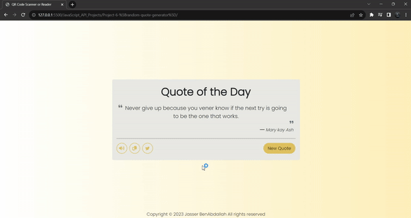

# random-quotes-generator

# Demo Project
### https://jasserba.github.io/random-quotes-generator/

#### Click to see full GIF

This project is a simple web application that generates random quotes and allows users to listen to the quotes, copy them to the clipboard, and share them on Twitter. It uses HTML, JavaScript, and Bootstrap 5 for styling.

## Table of Contents Readme

- [Introduction](#introduction)
- [Features](#features)
- [Getting Started](#getting-started)
- [Usage](#usage)
- [License](#license)

## Introduction

This project is designed to provide users with a daily dose of inspiration through random quotes. The application fetches quotes from the "https://api.quotable.io/random" API and displays them on the webpage. Users can interact with the quotes by listening to them, copying them to the clipboard, and sharing them on Twitter.

## Features

- Display a randomly fetched quote along with its author.
- Listen to the quote using the speech synthesis feature.
- Copy the quote to the clipboard.
- Share the quote on Twitter.

## Getting Started

To get started with the project, follow these steps:

1. Clone the repository: `git clone <repository-url>`
2. Navigate to the project directory.

## Usage

1. Open the `index.html` file in a web browser.
2. Click the "New Quote" button to generate a new random quote.
3. Click the sound icon to listen to the quote using the speech synthesis feature.
4. Click the clipboard icon to copy the quote to your clipboard.
5. Click the Twitter icon to share the quote on Twitter.

## License

This project is licensed under the [MIT License](LICENSE).

---

**Note:** This project was created for educational purposes and to showcase the usage of HTML, JavaScript, and Bootstrap 5 for building a simple random quotes generator. The project fetches quotes from an external API, so an internet connection is required for it to work properly.

For any questions or inquiries, please contact [Jasser BenAbdallah](mailto:your@email.com).
